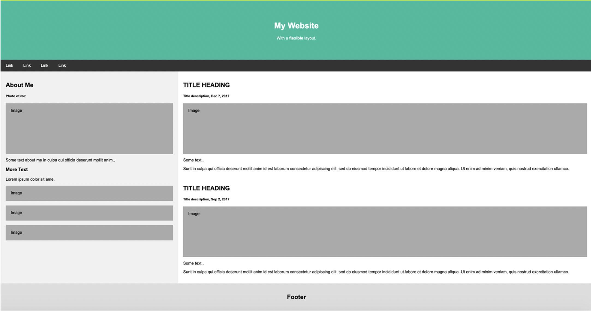
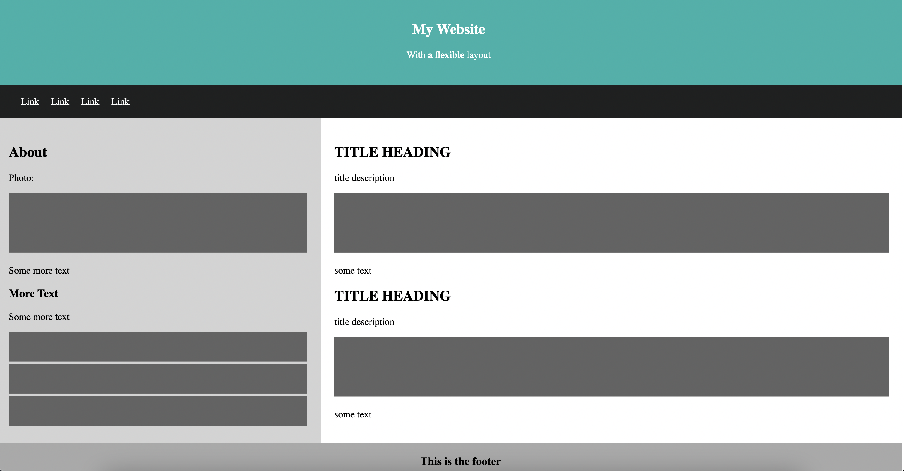
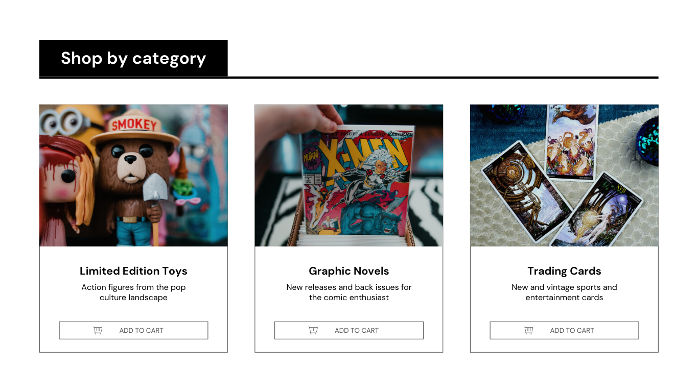
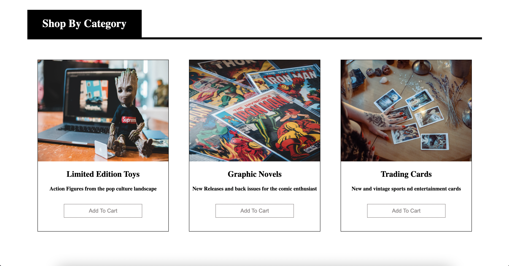
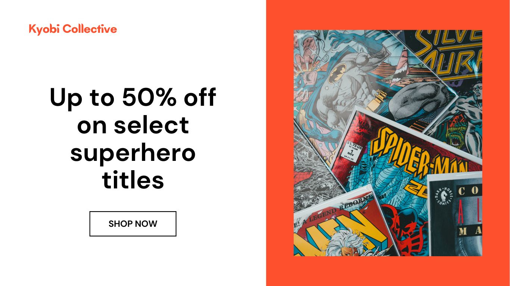

# Frontend Day 1
## 1. Learnyouhtml
>[Exercise](./learnyouhtml/)

## 2. Portfolio Webpage
Given Template:\

Exercise done:\

## 3. E shop webpages 
Given template for shop by category:

Exercise done:

Given template for item:

Exercise done:

